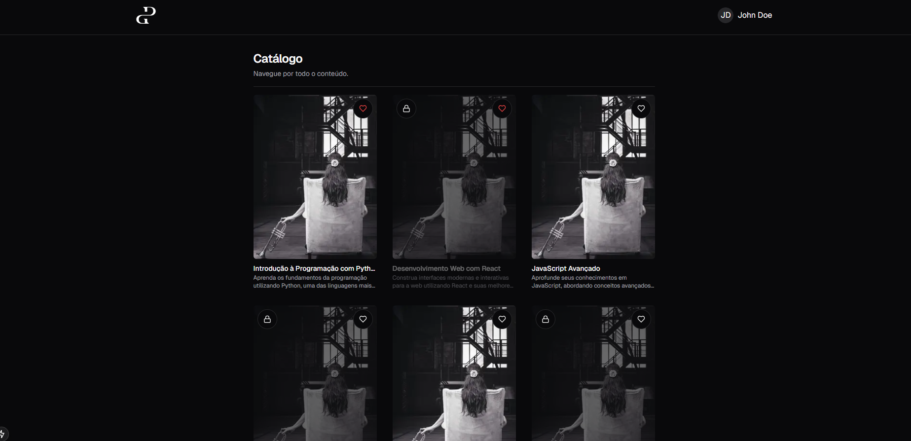
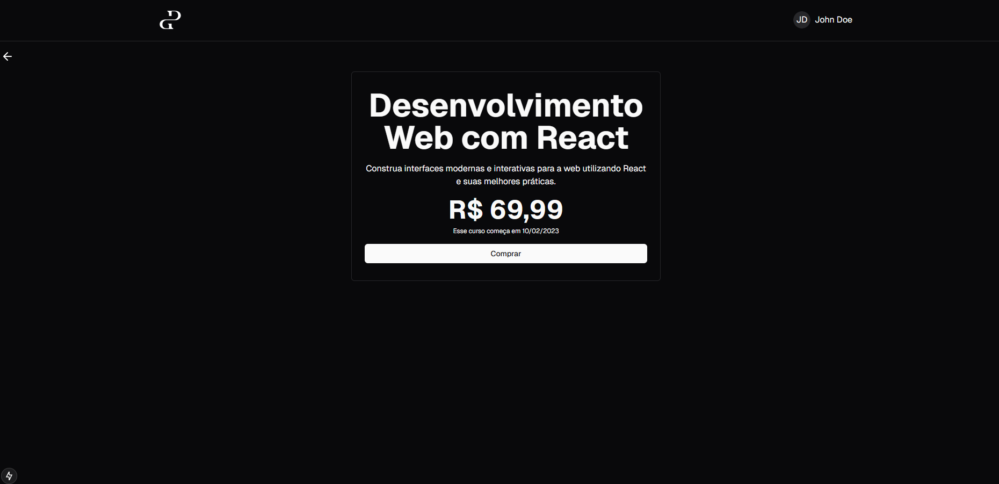
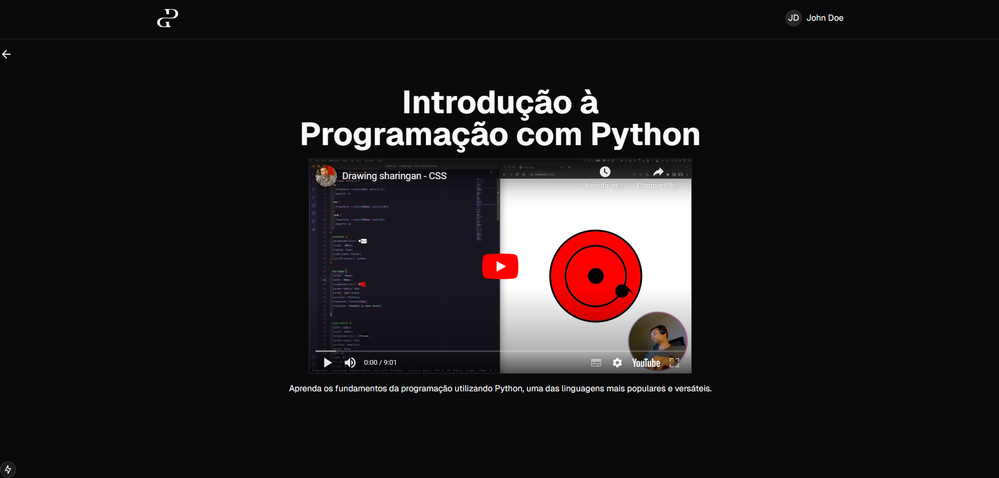

<h1 align="center">
    Teste técnico para posições de Front-end
</h1>
<p align="center"> Site simples de cursos que simula um usuário já logado que comprou 3 dos 10 cursos disponíveis 💻🚀 </p>

<h1 align="center">
  
<div style="display: flex; flex-direction: row;">
  
  
  <div>
</h1>

The following tools were used in the construction of the project:
> Global
- [Yarn](https://yarnpkg.com) or Npm
- [VSCode](https://code.visualstudio.com)
- [Git Bash](https://gitforwindows.org/)
> Frontend
- [ReactJS](https://reactjs.org)
- [NextJS](https://nextjs.org/)
- [Tailwindcss](https://tailwindcss.com/)
- [Vitest](https://vitest.dev/)

<h2 id="usage" > 👷 Usage </h2>

Required! Install git, node and yarn (or npm).

```bash
# Clone Repository
$ git clone https://github.com/RodrigoSaantos/permaneo.git

# Go to folder classroom
$ cd permaneo/

# Install Dependencies
$ yarn
# or
$ npm install

# Run Application
$ yarn dev
# or
$ npm run dev

# Access localhost
http://localhost:3000

# Run backend
$ npx json-server -w db.json -p 3333

# Access localhost
http://localhost:3333/
```

<h2 id="contribution"> 🤝 Contribution </h2>

This project is for study purposes too. All kinds of contributions are very welcome and appreciated!

- Fork this repository;
- Create a branch with your feature: `git checkout -b my-feature`;
- Commit your changes: `git commit -m 'feat: My new feature'`;
- Push to your branch: `git push origin my-feature`.

<h2 id="author"> 💻 Author </h2>


By Rodrigo Santos 👋🏽 Find me:

[](https://www.linkedin.com/in/rodrigo-dos-santos-silva-637225156/) 
| 
[](mailto:contato.rodrigosaantos@gmail.com)

<h2 id="license"> 📝 License </h2>

This project is under the MIT license.